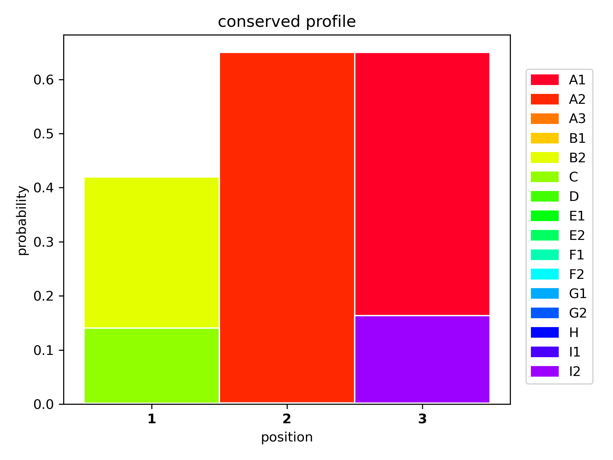

[](./LICENSE)

---

### Polyketide subunit monomer aligner

This repository contains a small program to perform multiple 
sequence alignment on polyketide backbone structures. 

The algorithm is a naive implementation of a progressive multiple sequence
alignment, using a guide tree constructed from pairwise alignments
(Needleman-Wunsch).

### Usage

#### Creating a multiple sequence alignment

An example input file is shown in `./data/pk_test.fasta`:
```text
>seq1
A1A2A1
>seq2
A1A2A1A1
>seq3
B2
>seq4
A2B2A1A1I1
>seq5
A1A2A1
>seq6
CA2A1
>seq7
CB2A1A1I2
```

A multiple sequence alignment of the sequences displayed above can be performed
by running 
`./scripts/run_multiple_sequence_alignment ./data/pk_test.fasta > ./out/pk_test_msa.fasta` 
from root.

The output file should look like this (`-` denotes a gap):
```text
>seq2
-A1A2A1A1
>seq1
-A1A2-A1
>seq5
-A1A2-A1
>seq6
-CA2-A1
>seq3
-B2---
>seq4
A2B2A1A1I1
>seq7
CB2A1A1I2
```

##### Optional settings

`--gap`: gap penalty (default: 2)

`--end`: end gap penalty (default: 2)

#### Generating new polyketide backbones

A HMM can be constructed from the output MSA file to generate new polyketide
backbones with the same conserved motif by running 
`./scripts/generate_polyketide_backbones.py 1000 > ./out/pk_test_generated_backbones.fasta`
from root. The number of sequences to generated can be set (in this command: 1000).

#### Visualizing conserved region in set of polyketide backbones

A stacked barplot logo can be created from MSA to visualize the HMM conserved
region by running 
`./scripts/make_logo_from_msa.py  ./out/pk_test_msa.fasta --out ./out/pk_test_hmm_logo.png`
from root.


